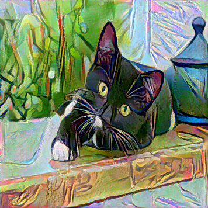
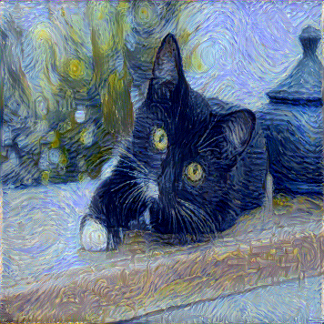

# neural-style-transfer-pytorch
[Neural style transfer (NST)](https://en.wikipedia.org/wiki/Neural_style_transfer) refers to a class of software algorithms that manipulate digital images, or videos, in order to adopt the appearance or visual style of another image. NST algorithms are characterized by their use of deep neural networks for the sake of image transformation. Common uses for NST are the creation of artificial artwork from photographs, for example by transferring the appearance of famous paintings to user-supplied photographs.

This is a pytorch implementation of [A Neural Algorithm of Artistic Style](https://arxiv.org/abs/1508.06576).
# Setup And Run
Code is developed under following library dependencies
```commandline
python 3.7
torch 1.12.0
torchtext 0.13
torchvision 0.13
```
Start with creating a virtual environment then open your terminal and follow the following steps:
```commandline
git clone "https://github.com/zaghlol94/neural-style-transfer-pytorch"
cd neural-style-transfer-pytorch
pip install -r requirements.txt
python nst.py -o "original image path" -s "style image path"
```
## Results

<p float="left">
  
   
  
</p>

<p float="left">
  
   
  
</p>

